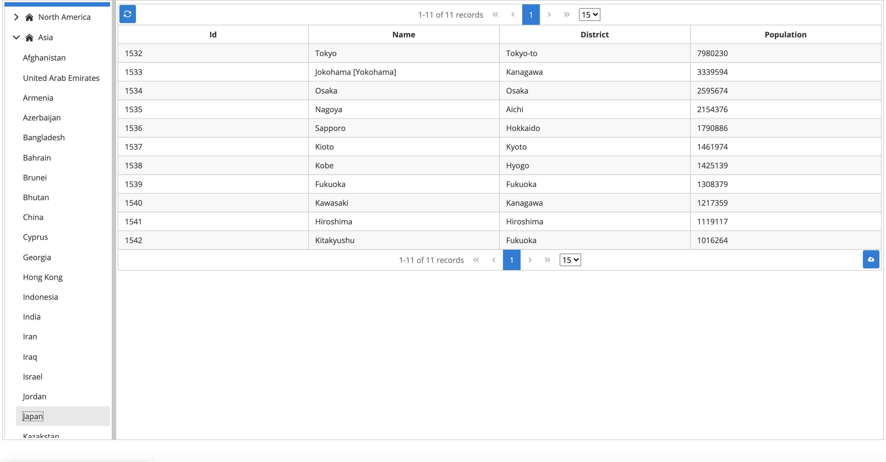
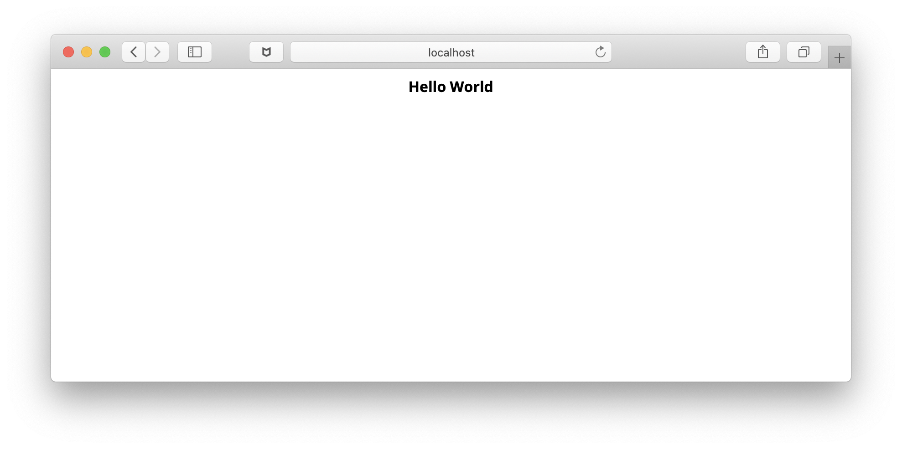
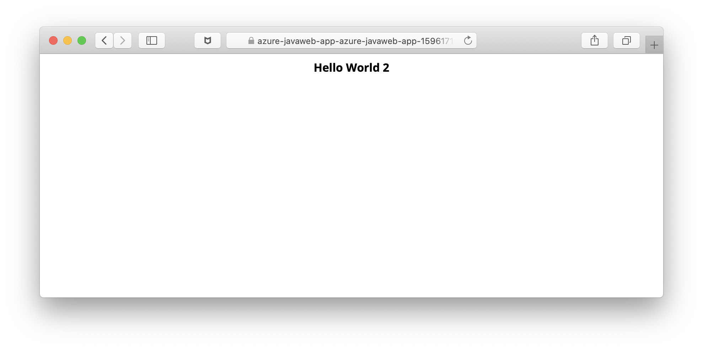
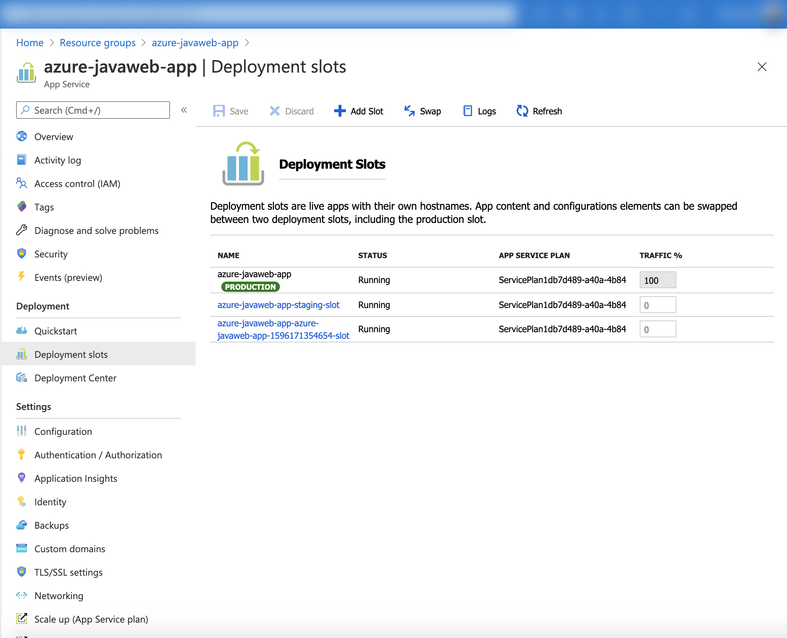
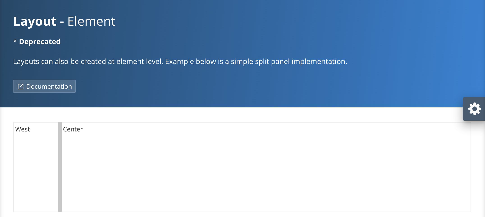
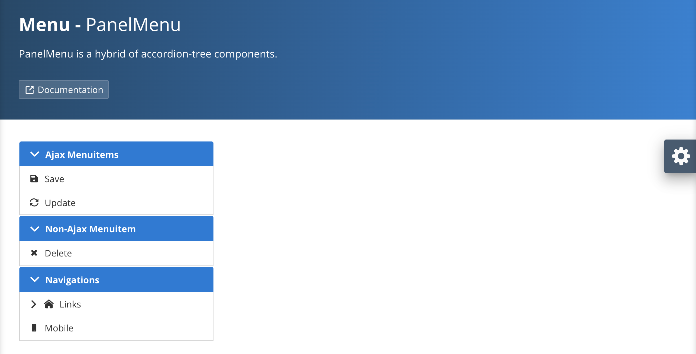
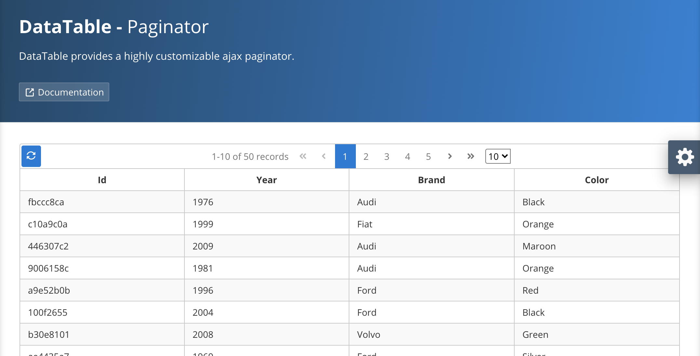

# Deploy Java Web App to Tomcat9 on Azure App Service on Linux 


## Overview of this Application

This Java Web Application is not Microservices Application but standard Java Web Application which is wrote by using Java EE 8 technologies.  

At first, you can select and expand the Continent (North America, Asia, Africa, Europe, South America, Oceania, Antarctica) in the left side of the menu, then you can see the countries in the Continent. Then you can select the one country, then you can see the cities where has the number of the population over 1,000,000 in right side of the screen like follows.  
Data is coming from Managed [Azure Database for MySQL](https://docs.microsoft.com/azure/mysql/?WT.mc_id=docs-github-yoterada) or Managed [Azure SQL Database](https://learn.microsoft.com/en-us/azure/azure-sql/database/sql-database-paas-overview?view=azuresql).



The following sections include step by step guide of how to create a Web App project and how to create the Java application. 
You can also jump into subfolder [java-webapp-myssql](java-webapp-with-mysql) and [java-webapp-mssql](java-webapp-with-mssql) to run the application for a quick test.

## Runtime selection of Azure App Service on Linux for Java

In order to confirm which Java Runtime we can use on [Azure App Service on Linux](https://docs.microsoft.com/azure/app-service/containers/app-service-linux-intro?WT.mc_id=docs-github-yoterada), you can execute the following command.  

`az webapp list-runtimes --linux`

```azurecli
az webapp list-runtimes --linux 
  "TOMCAT|8.5-jre8",
  "TOMCAT|9.0-jre8",
  "JAVA|8-jre8",
  "WILDFLY|14-jre8",
  "TOMCAT|8.5-java11",
  "TOMCAT|9.0-java11",
  "JAVA|11-java11",
```

For example, if you select the `JAVA`, you can deploy and run the Executable JAR file like Spring Boot or MicroProfile and it will run on Docker Container. And if you select the `TOMCAT` or `WILDFLY`, you can deploy and run the `***.war` file and it will run on Linux. You can also select the Java Runtime between Java 8 or Java 11.  

In this application, we will use the `TOMACT 9.0` and `Java11`.


## More Detail Runtime Environment

This appication will run on Tomcat 9 with JDK 11. In this application, I used following technologies.

* JDK 11
* Servlet (4.0.1)
* JavaServer Faces (2.4)
* PrimeFaces (8.0)
* JSP Standard Tag Library-JSTL (1.2)
* Weld-CDI (2.4.8.Final)
* Mysql Connector (8.0.21)
* Java Persistence API-JPA (2.2)
* EcliseLink (2.7.7)
* Bean Validation (1.1.0.Final)
* Jakarta JSON-B (1.0.2)

On Azure Web App Tomcat on Linux environment, following JDK (Zulu OpenJDK) is installed.  

```bash
# java -version
openjdk version "11.0.3" 2019-04-16 LTS
OpenJDK Runtime Environment 19.4-(Zulu-11.31+11-linux-musl-x64)-Microsoft-Azure-restricted (build 11.0.3+7-LTS)
OpenJDK 64-Bit Server VM 19.4-(Zulu-11.31+11-linux-musl-x64)-Microsoft-Azure-restricted (build 11.0.3+7-LTS, mixed mode)
```
[Java long-term support and medium-term support on Azure and Azure Stack](https://docs.microsoft.com/azure/developer/java/fundamentals/java-jdk-long-term-support?WT.mc_id=docs-github-yoterada)

## Setup Database before creating the Java Web App

In order to run this application, you need to install and configure the database before the deploy.

This application can be run with both MySQL and Azure SQL. You can set up one of them per your requirement and configure corresponding setting in Web Application.

### Setup Azure Database for MySQL

In order to install and create the MySQL, please refer to the following documents.

[Create DB for MySQL on Azure](https://github.com/yoshioterada/microprofile-samples/blob/master/MySQL/Azure-MySQL-Setup-For-Sample-App.md) for preparation of this Java Web App.

### Setup Azure SQL database

Follow [Setup Azure SQL database](java-webapp-with-mssql/AzureSQL-Setup-For-Sample-App.md) to create database and import world data.

## Create Maven Project for Java Web App

```bash
mvn archetype:generate \
    -DarchetypeGroupId=de.rieckpil.archetypes \
    -DarchetypeArtifactId=javaee8-jsf \
    -DarchetypeVersion=1.0.1 \
    -DgroupId=com.microsoft.azure.samples \
    -Dpackage=com.microsoft.azure.samples \
    -Dversion=0.0.1-SNAPSHOT \
    -DartifactId=azure-javaweb-app \
    -Darchetype.interactive=false \
    --batch-mode 
```

```bash  
ls
azure-javaweb-app
$ cd azure-javaweb-app/
$ ls
pom.xml	src
```

```text
├── Dockerfile (delete)
├── buildAndRun.bat (delete)
├── buildAndRun.sh (delete)
├── pom.xml
└── src
    ├── main
    │   ├── java
    │   │   └── sample
    │   │       └── SampleBean.java
    │   ├── resources
    │   │   └── META-INF
    │   │       ├── microprofile-config.properties (delete)
    │   │       └── persistence.xml
    │   └── webapp
    │       ├── WEB-INF
    │       │   ├── beans.xml 
    │       │   ├── payara-web.xml  (delete)
    │       │   └── web.xml
    │       └── index.xhtml
    └── test
        └── java
```

The above directory structure will be automatically created and it is created to run on Payara on Docker. However we will deploy the Web Application to Tomcat 9 not Docker in this time. So please delete some files?

## Modify the pom.xml file

### Modify

```xml
		<maven.compiler.source>11</maven.compiler.source>
		<maven.compiler.target>11</maven.compiler.target>
```

### Delete

```xml
	<repositories>
		<repository>
			<id>prime-repo</id>
			<name>PrimeFaces Maven Repository</name>
			<url>http://repository.primefaces.org</url>
			<layout>default</layout>
		</repository>
	</repositories>
```

### Modify

The following pom.xml file is for MySQL.

```
<?xml version="1.0" encoding="UTF-8"?>

<project xmlns="http://maven.apache.org/POM/4.0.0" xmlns:xsi="http://www.w3.org/2001/XMLSchema-instance" xsi:schemaLocation="http://maven.apache.org/POM/4.0.0 http://maven.apache.org/xsd/maven-4.0.0.xsd">  
    <modelVersion>4.0.0</modelVersion>  
    <groupId>com.microsoft.azure.samples</groupId>  
    <artifactId>azure-javaweb-app</artifactId>  
    <version>0.0.1-SNAPSHOT</version>  
    <packaging>war</packaging>  
    <properties> 
        <project.build.sourceEncoding>UTF-8</project.build.sourceEncoding> 
    </properties>  
    <dependencies> 
        <dependency> 
            <groupId>javax.servlet</groupId>  
            <artifactId>javax.servlet-api</artifactId>  
            <version>4.0.1</version>  
            <scope>provided</scope> 
        </dependency>  
        <dependency> 
            <groupId>org.glassfish</groupId>  
            <artifactId>javax.faces</artifactId>  
            <version>2.4.0</version> 
        </dependency>  
        <dependency> 
            <groupId>javax.faces</groupId>  
            <artifactId>javax.faces-api</artifactId>  
            <version>2.3</version> 
        </dependency>  
        <!-- https://mvnrepository.com/artifact/org.primefaces/primefaces -->  
        <dependency> 
            <groupId>org.primefaces</groupId>  
            <artifactId>primefaces</artifactId>  
            <version>8.0</version> 
        </dependency> 
        <dependency> 
            <groupId>jstl</groupId>  
            <artifactId>jstl</artifactId>  
            <version>1.2</version> 
        </dependency>  
        <dependency> 
            <groupId>org.jboss.weld.servlet</groupId>  
            <artifactId>weld-servlet</artifactId>  
            <version>2.4.8.Final</version> 
        </dependency>  
        <dependency>
            <groupId>mysql</groupId>
            <artifactId>mysql-connector-java</artifactId>
            <version>8.0.21</version>
        </dependency>

        <!-- https://mvnrepository.com/artifact/javax.persistence/javax.persistence-api -->
        <dependency>
            <groupId>javax.persistence</groupId>
            <artifactId>javax.persistence-api</artifactId>
            <version>2.2</version>
        </dependency>
        <!-- https://mvnrepository.com/artifact/javax.validation/validation-api -->
        <dependency>
            <groupId>javax.validation</groupId>
            <artifactId>validation-api</artifactId>
            <version>2.0.1.Final</version>
        </dependency>

        <dependency>
            <groupId>org.eclipse.persistence</groupId>
            <artifactId>eclipselink</artifactId>
            <version>2.7.7</version>
        </dependency>
        <dependency>
            <groupId>javax.transaction</groupId>
            <artifactId>javax.transaction-api</artifactId>
            <version>1.3</version>
        </dependency>
        <!-- https://mvnrepository.com/artifact/jakarta.json.bind/jakarta.json.bind-api -->
        <dependency>
            <groupId>jakarta.json.bind</groupId>
            <artifactId>jakarta.json.bind-api</artifactId>
            <version>1.0.2</version>
        </dependency>

    </dependencies>  
    <!-- Plugin Manven e Java -->  
    <build> 
        <finalName>azure-javaweb-app</finalName>  
        <plugins> 
            <plugin> 
                <artifactId>maven-compiler-plugin</artifactId>  
                <version>3.3</version>  
                <configuration> 
                    <source>11</source>  
                    <target>11</target>  
                    <downloadJavadocs>true</downloadJavadocs> 
                </configuration> 
            </plugin>  
            <plugin>
                <groupId>org.apache.maven.plugins</groupId>
                <artifactId>maven-war-plugin</artifactId>
                <version>2.3</version>
                <configuration>
                    <failOnMissingWebXml>false</failOnMissingWebXml>
                </configuration>
            </plugin>
        </plugins> 
    </build> 
</project>

```

For Azure SQL, replace MySQL dependency:

```xml
<dependency>
    <groupId>mysql</groupId>
    <artifactId>mysql-connector-java</artifactId>
    <version>8.0.21</version>
</dependency>
```

With SQL dependency:

```xml
<dependency>
    <groupId>com.microsoft.sqlserver</groupId>
    <artifactId>mssql-jdbc</artifactId>
    <version>12.6.1.jre11</version>
</dependency>
```

## Modify web.xml file

```xml
<?xml version="1.0" encoding="UTF-8"?>
<web-app version="4.0"
         xmlns="http://xmlns.jcp.org/xml/ns/javaee"
         xmlns:xsi="http://www.w3.org/2001/XMLSchema-instance"
         xsi:schemaLocation="http://xmlns.jcp.org/xml/ns/javaee http://xmlns.jcp.org/xml/ns/javaee/web-app_4_0.xsd">
    <servlet>
        <servlet-name>Faces Servlet</servlet-name>
        <servlet-class>javax.faces.webapp.FacesServlet</servlet-class>
        <load-on-startup>1</load-on-startup>
    </servlet>

    <context-param>
        <param-name>primefaces.THEME</param-name>
        <param-value>nova-light</param-value>
    </context-param>

    <servlet-mapping>
        <servlet-name>Faces Servlet</servlet-name>
        <url-pattern>*.xhtml</url-pattern>
    </servlet-mapping>

    <welcome-file-list>
        <welcome-file>index.xhtml</welcome-file>
    </welcome-file-list>

    <context-param>
        <param-name>javax.faces.PROJECT_STAGE</param-name>
        <param-value>Development</param-value>
    </context-param>
</web-app>
```

## Configure the Maven plugin for Azure App Service

In order to deploy the Java Web App to Azure App Service, if you configure the [Maven plugin for Azure App Service](https://docs.microsoft.com/java/api/overview/azure/maven/azure-webapp-maven-plugin/readme?view=azure-java-stable&WT.mc_id=docs-github-yoterada), you can create the Azure Resources and deploy the Web App with very easily. 
Please execute the following command?

```azurecli
mvn com.microsoft.azure:azure-webapp-maven-plugin:2.13.0:config
```

If you execute the command, it will show following question. If you answer all of the qeustion, the plugin will automatically added the configuration to deploy to Azure.

```azurecli
$ mvn com.microsoft.azure:azure-webapp-maven-plugin:2.13.0:config
Create new run configuration (Y/N) [Y]: y
Define value for OS [Linux]:
  1: Windows
* 2: Linux
  3: Docker
Enter your choice: 2
Define value for javaVersion [Java 17]:
* 1: Java 17
  2: Java 11
  3: Java 8
Enter your choice: 2
Define value for webContainer [Tomcat 10.0]:
* 1: Tomcat 10.0
  2: Tomcat 9.0
  3: Tomcat 8.5
  4: Jbosseap 7
Enter your choice: 2
Define value for pricingTier [P1v2]:
   1: D1
   2: B3
*  3: P1v2
   4: P1v3
   5: P2v2
   6: P2v3
   7: P3v2
   8: P3v3
   9: B1
  10: B2
  11: F1
  12: S1
  13: S2
  14: S3
  15: EP3
  16: EP2
  17: EP1
  18: Y1
  19: FC1
Enter your choice: 3
Please confirm webapp properties
AppName : azure-javaweb-app-1709710313394
ResourceGroup : azure-javaweb-app-1709710313394-rg
Region : westeurope
PricingTier : P1v2
OS : Linux
Java Version: Java 11
Web server stack: Tomcat 9.0
Deploy to slot : false
Confirm (Y/N)? : Y
[INFO] Saving configuration to pom.
[INFO] ------------------------------------------------------------------------
[INFO] BUILD SUCCESS
[INFO] ------------------------------------------------------------------------
[INFO] Total time:  01:31 min
[INFO] Finished at: 2020-07-29T01:51:38+09:00
[INFO] ------------------------------------------------------------------------
```

After finished the command, you will be able to see following additional configuration was added to the `pom.xml` file.

```
      <plugin>
        <groupId>com.microsoft.azure</groupId>
        <artifactId>azure-webapp-maven-plugin</artifactId>
        <version>2.13.0</version>
        <configuration>
          <schemaVersion>V2</schemaVersion>
          <resourceGroup>azure-javaweb-app-1709710313394-rg</resourceGroup>
          <appName>azure-javaweb-app-1709710313394</appName>
          <pricingTier>P1v2</pricingTier>
          <region>westeurope</region>
          <runtime>
            <os>linux</os>
            <javaVersion>java11</javaVersion>
            <webContainer>TOMCAT 9.0</webContainer>
          </runtime>
          <deployment>
            <resources>
              <resource>
                <directory>${project.basedir}/target</directory>
                <includes>
                  <include>*.war</include>
                </includes>
              </resource>
            </resources>
          </deployment>
        </configuration>
      </plugin>
```

### You can modify the name of Azure Resource Group and location

The above configuration will create and deploy to the following environment.

* Azure Resoure Group : `azure-javaweb-app-1709710313394-rg`
* Azure Resource Name : `azure-javaweb-app-1709710313394`
* Azure Resoruce Location : `westeurope`

If you would like to change the Resource Group Name, Resource Name and Location, you can change the configuration like follows.

```
        <configuration>
          <schemaVersion>V2</schemaVersion>
          <resourceGroup>azure-javaweb-app</resourceGroup>
          <appName>azure-javaweb-app</appName>
          <pricingTier>P1v2</pricingTier>
          <region>japaneast</region>
          <runtime>
```

## Modify the Java Source Code

```
<html xmlns="http://www.w3.org/1999/xhtml" xmlns:h="http://java.sun.com/jsf/html" xmlns:f="http://java.sun.com/jsf/core"
	xmlns:p="http://primefaces.org/ui">

<h:head>
	<title>Hello World JSF 2.3</title>
</h:head>

<h:body>
	<p:outputPanel style="display:block">
		<h3 style="text-align: center">#{sampleBean.message}</h3>
	</p:outputPanel>
</h:body>

</html>
```

Please remove following from html tag?
`xmlns:o="http://omnifaces.org/ui"
	xmlns:of="http://omnifaces.org/functions"`


```
package sample;

import javax.enterprise.context.RequestScoped;
import javax.inject.Named;

@Named
@RequestScoped
public class SampleBean {

	private String message;

	public String getMessage() {
		message = "Hello World";
		return message;
	}
}
```

## Deploy and Run on Local Environment

After you implemented the above code, you can deploy to the Tomcat in Local.
If you access to Tomcat server from Browser, you can see like following.s




## Deploy Java Web App to Azure App Service

If you would like to deploy the Java Web App to Azure, you can execute the following command.

`mvn azure-webapp:deploy`

Following is the example of the command.

```
$ mvn clean package  azure-webapp:deploy
[INFO] Scanning for projects...
[INFO] 
[INFO] -----------< com.microsoft.azure.samples:azure-javaweb-app >------------
[INFO] Building azure-javaweb-app 0.0.1-SNAPSHOT
[INFO] --------------------------------[ war ]---------------------------------
[INFO] 
[INFO] --- maven-clean-plugin:2.5:clean (default-clean) @ azure-javaweb-app ---
[INFO] Deleting /Users/yoterada/azure-javaweb-app/target

[INFO] --- azure-webapp-maven-plugin:2.13.0:deploy (default-cli) @ azure-javaweb-app ---
[INFO] Auth Type : AZURE_CLI, Auth Files : [/Users/yoterada/.azure/azureProfile.json, /Users/yoterada/.azure/accessTokens.json]
[INFO] [Correlation ID: 3a3d53b9-7f39-4e46-b42f-3d4c91ed34df] Instance discovery was successful
[INFO] Subscription : Microsoft Azure Internal Billing-CDA(f77aafe8-6be4-4d3d-bd9c-d0c37687ef70)
[INFO] Target Web App doesn't exist. Creating a new one...
[INFO] Creating App Service Plan 'ServicePlan2932ed54-b243-4c68'...
[INFO] Successfully created App Service Plan.
[INFO] Successfully created Web App.
[INFO] Using 'UTF-8' encoding to copy filtered resources.
[INFO] Copying 1 resource to /Users/yoterada/azure-javaweb-app/target/azure-webapp/azure-javaweb-app-1596171354654-22bf0c41-c96b-4ef9-a96a-4b48de368374
[INFO] Trying to deploy artifact to azure-javaweb-app-1596171354654...
[INFO] Deploying the war file azure-javaweb-app.war...
[INFO] Successfully deployed the artifact to https://azure-javaweb-app-1596171354654.azurewebsites.net
[INFO] ------------------------------------------------------------------------
[INFO] BUILD SUCCESS
[INFO] ------------------------------------------------------------------------
[INFO] Total time:  07:55 min
[INFO] Finished at: 2020-07-31T14:23:01+09:00
[INFO] ------------------------------------------------------------------------
```

If you acces to the URL in the above logs, you can see the following screen.

```
[INFO] Successfully deployed the artifact to 
https://azure-javaweb-app-1596171354654.azurewebsites.net
```


## Deploy the Java Web App to Staging Environment (Deployment Slot)

If you execute the `mvn azure-webapp:config` command again, you can configure the [DeploymentSlot](https://docs.microsoft.com/azure/app-service/deploy-staging-slots?WT.mc_id=docs-github-yoterada) as follows. 

### Configure the Deployment Slot

```
$ mvn azure-webapp:config
Picked up JAVA_TOOL_OPTIONS: -Dfile.encoding=UTF-8
[INFO] Scanning for projects...
[INFO] 
[INFO] -----------< com.microsoft.azure.samples:azure-javaweb-app >------------
[INFO] Building azure-javaweb-app 0.0.1-SNAPSHOT
[INFO] --------------------------------[ war ]---------------------------------
[INFO] 
[INFO] --- azure-webapp-maven-plugin:2.13.0:config (default-cli) @ azure-javaweb-app ---
Please choose which part to config
1. Application
2. Runtime
3. DeploymentSlot
Enter index to use: 3
Deploy to slot?(Y/N): y
Define value for slotName(Default: azure-javaweb-app-1596171354654-slot): 
Define value for configurationSource: 
Please confirm webapp properties
AppName : azure-javaweb-app-1596171354654
ResourceGroup : azure-javaweb-app-1596171354654-rg
Region : westeurope
PricingTier : PremiumV2_P1v2
OS : Linux
RuntimeStack : TOMCAT 9.0-java11
Deploy to slot : true
Slot name : azure-javaweb-app-1596171354654-slot
ConfigurationSource : 
Confirm (Y/N)? : y
[INFO] Saving configuration to pom.
[INFO] ------------------------------------------------------------------------
[INFO] BUILD SUCCESS
[INFO] ------------------------------------------------------------------------
[INFO] Total time:  02:15 min
[INFO] Finished at: 2020-07-31T14:44:33+09:00
[INFO] ------------------------------------------------------------------------
$ 
```

After finished the above command, you can see the following XML in the `pom.xml`.

```xml
          <deploymentSlot>
            <name>azure-javaweb-app-1596171354654-slot</name>
            <configurationSource></configurationSource>
          </deploymentSlot>
```

### Deploy the Java Web App the Deployment Slot

After the configuration, if you executed the `mvn azure-webapp:deploy` command, new `Deployment Slot` will be automatically created and deploy the Web App to it.

Please modify the source code like follows.

```java
package sample;

import javax.enterprise.context.RequestScoped;
import javax.inject.Named;

@Named
@RequestScoped
public class SampleBean {

	private String message;

	public String getMessage() {
		message = "Hello World 2";
		return message;
	}
}
```

Then, you build the new package and deploy it to the Deployment Slot?

```bash
$ mvn clean package azure-webapp:deploy
Picked up JAVA_TOOL_OPTIONS: -Dfile.encoding=UTF-8
[INFO] Scanning for projects...
[INFO] 
[INFO] -----------< com.microsoft.azure.samples:azure-javaweb-app >------------
[INFO] Building azure-javaweb-app 0.0.1-SNAPSHOT
[INFO] --------------------------------[ war ]---------------------------------
[INFO] 
[INFO] --- maven-clean-plugin:2.5:clean (default-clean) @ azure-javaweb-app ---
[INFO] Deleting /Users/yoterada/azure-javaweb-app/target

[INFO] [Correlation ID: a533c9be-a1b8-4209-b789-a43016e5827c] Instance discovery was successful
[INFO] Subscription : Microsoft Azure Internal Billing-CDA(f77aafe8-6be4-4d3d-bd9c-d0c37687ef70)
[INFO] Updating target Web App...
[INFO] Successfully updated Web App.
[INFO] Target Deployment Slot doesn't exist. Creating a new one...
[INFO] Creating a new deployment slot and copying configuration from parent...
[INFO] Successfully created the Deployment Slot.
[INFO] Using 'UTF-8' encoding to copy filtered resources.
[INFO] Copying 1 resource to /Users/yoterada/azure-javaweb-app/target/azure-webapp/azure-javaweb-app-bcdbe5b1-78a3-47c5-9b8f-567a4e16911e
[INFO] Trying to deploy artifact to azure-javaweb-app-1596171354654-slot...
[INFO] Deploying the war file azure-javaweb-app.war...
[INFO] Successfully deployed the artifact to https://azure-javaweb-app-azure-javaweb-app-1596171354654-slot.azurewebsites.net
[INFO] ------------------------------------------------------------------------
[INFO] BUILD SUCCESS
[INFO] ------------------------------------------------------------------------
[INFO] Total time:  02:15 min
[INFO] Finished at: 2020-07-31T14:52:53+09:00
[INFO] ------------------------------------------------------------------------
```

Then you can see the follogin logs.

```
[INFO] Successfully deployed the artifact to https://azure-javaweb-app-azure-javaweb-app-1596171354654-slot.azurewebsites.net
```




Azure Deployment Slot is very useful for evaluation, and you can create multiple deployment slot like follows.




# Implement DB Access code from Web Application

## Implement JPA code which access to MySQL

[Jakarta Persistence](https://jakarta.ee/specifications/persistence/2.2/) API is the Java API for the management of persistence and object/relational mapping framework in Jakarta EE and Java SE environments.  

***Note  
Tomcat is not the Jakarta EE compiant Application Server and it doesn't support the Transaction API support. So in the Tomcat environment, you need to implement the JPA code same as Java SE environment.***

### Create Entity Class which map to the DB TABLE

I already created the following DB TABLE in MySQL.

```
mysql> DESC `city`;
+-------------+----------+------+-----+---------+----------------+
| Field       | Type     | Null | Key | Default | Extra          |
+-------------+----------+------+-----+---------+----------------+
| ID          | int(11)  | NO   | PRI | NULL    | auto_increment |
| Name        | char(35) | NO   |     |         |                |
| CountryCode | char(3)  | NO   | MUL |         |                |
| District    | char(20) | NO   |     |         |                |
| Population  | int(11)  | NO   |     | 0       |                |
+-------------+----------+------+-----+---------+----------------+
5 rows in set (0.01 sec)

mysql> DESC `country`;
+----------------+---------------------------------------------------------------------------------------+------+-----+---------+-------+
| Field          | Type                                                                                  | Null | Key | Default | Extra |
+----------------+---------------------------------------------------------------------------------------+------+-----+---------+-------+
| Code           | char(3)                                                                               | NO   | PRI |         |       |
| Name           | char(52)                                                                              | NO   |     |         |       |
| Continent      | enum('Asia','Europe','North America','Africa','Oceania','Antarctica','South America') | NO   |     | Asia    |       |
| Region         | char(26)                                                                              | NO   |     |         |       |
| SurfaceArea    | decimal(10,2)                                                                         | NO   |     | 0.00    |       |
| IndepYear      | smallint(6)                                                                           | YES  |     | NULL    |       |
| Population     | int(11)                                                                               | NO   |     | 0       |       |
| LifeExpectancy | decimal(3,1)                                                                          | YES  |     | NULL    |       |
| GNP            | decimal(10,2)                                                                         | YES  |     | NULL    |       |
| GNPOld         | decimal(10,2)                                                                         | YES  |     | NULL    |       |
| LocalName      | char(45)                                                                              | NO   |     |         |       |
| GovernmentForm | char(45)                                                                              | NO   |     |         |       |
| HeadOfState    | char(60)                                                                              | YES  |     | NULL    |       |
| Capital        | int(11)                                                                               | YES  |     | NULL    |       |
| Code2          | char(2)                                                                               | NO   |     |         |       |
+----------------+---------------------------------------------------------------------------------------+------+-----+---------+-------+
15 rows in set (0.02 sec)
```

In order to create the mapped class, please create following Entity class?

#### Country Entity Class

```java
@Entity
@Table(name = "country")
@NamedQueries({
    @NamedQuery(name = "Country.findAll", query = "SELECT c FROM Country c"),
    @NamedQuery(name = "Country.findByCode", query = "SELECT c FROM Country c WHERE c.code = :code"),
    @NamedQuery(name = "Country.findByName", query = "SELECT c FROM Country c WHERE c.name = :name"),
    @NamedQuery(name = "Country.findAllContinent", query = "SELECT DISTINCT c.continent FROM Country c"),
    @NamedQuery(name = "Country.findByContinent", query = "SELECT c FROM Country c WHERE c.continent = :continent"),
    @NamedQuery(name = "Country.findByRegion", query = "SELECT c FROM Country c WHERE c.region = :region"),
    @NamedQuery(name = "Country.findBySurfaceArea", query = "SELECT c FROM Country c WHERE c.surfaceArea = :surfaceArea"),
    @NamedQuery(name = "Country.findByIndepYear", query = "SELECT c FROM Country c WHERE c.indepYear = :indepYear"),
    @NamedQuery(name = "Country.findByPopulation", query = "SELECT c FROM Country c WHERE c.population = :population"),
    @NamedQuery(name = "Country.findByLifeExpectancy", query = "SELECT c FROM Country c WHERE c.lifeExpectancy = :lifeExpectancy"),
    @NamedQuery(name = "Country.findByGnp", query = "SELECT c FROM Country c WHERE c.gnp = :gnp"),
    @NamedQuery(name = "Country.findByGNPOld", query = "SELECT c FROM Country c WHERE c.gNPOld = :gNPOld"),
    @NamedQuery(name = "Country.findByLocalName", query = "SELECT c FROM Country c WHERE c.localName = :localName"),
    @NamedQuery(name = "Country.findByGovernmentForm", query = "SELECT c FROM Country c WHERE c.governmentForm = :governmentForm"),
    @NamedQuery(name = "Country.findByHeadOfState", query = "SELECT c FROM Country c WHERE c.headOfState = :headOfState"),
    @NamedQuery(name = "Country.findByCapital", query = "SELECT c FROM Country c WHERE c.capital = :capital"),
    @NamedQuery(name = "Country.findByCode2", query = "SELECT c FROM Country c WHERE c.code2 = :code2")})
public class Country implements Serializable {

    private static final long serialVersionUID = 1L;
    @Id
    @Basic(optional = false)
    @NotNull
    @Size(min = 1, max = 3)
    @Column(name = "Code")
    private String code;
    @Basic(optional = false)
    @NotNull
    @Size(min = 1, max = 52)
    @Column(name = "Name")
    private String name;
    @Basic(optional = false)
    @NotNull
    @Size(min = 1, max = 13)
    @Column(name = "Continent")
    private String continent;
    @Basic(optional = false)
    @NotNull
    @Size(min = 1, max = 26)
    @Column(name = "Region")
    private String region;
    @Basic(optional = false)
    @NotNull
    @Column(name = "SurfaceArea")
    private BigDecimal surfaceArea;
    @Column(name = "IndepYear")
    private Short indepYear;
    @Basic(optional = false)
    @NotNull
    @Column(name = "Population")
    private int population;
    @Column(name = "LifeExpectancy")
    private BigDecimal lifeExpectancy;
    @Column(name = "GNP")
    private BigDecimal gnp;
    @Column(name = "GNPOld")
    private BigDecimal gNPOld;
    @Basic(optional = false)
    @NotNull
    @Size(min = 1, max = 45)
    @Column(name = "LocalName")
    private String localName;
    @Basic(optional = false)
    @NotNull
    @Size(min = 1, max = 45)
    @Column(name = "GovernmentForm")
    private String governmentForm;
    @Size(max = 60)
    @Column(name = "HeadOfState")
    private String headOfState;
    @Column(name = "Capital")
    private Integer capital;
    @Basic(optional = false)
    @NotNull
    @Size(min = 1, max = 2)
    @Column(name = "Code2")
    private String code2;

    @JsonbTransient
    @OneToMany(cascade = CascadeType.ALL, mappedBy = "countryCode")
    private Collection<City> cityCollection;

    // Setter & Getter
}
```

#### City Entity Class

```java
@Entity
@Table(name = "city")
@NamedQueries({
    @NamedQuery(name = "City.findAll", query = "SELECT c FROM City c"),
    @NamedQuery(name = "City.findById", query = "SELECT c FROM City c WHERE c.id = :id"),
    @NamedQuery(name = "City.findByName", query = "SELECT c FROM City c WHERE c.name = :name"),
    @NamedQuery(name = "City.findByDistrict", query = "SELECT c FROM City c WHERE c.district = :district"),
    @NamedQuery(name = "City.findByPopulation", query = "SELECT c FROM City c WHERE c.population = :population"),
    @NamedQuery(name = "City.findOver1MillPopulation", query = "SELECT c FROM City c WHERE c.countryCode.code = :countrycode AND c.population > 1000000 ORDER BY c.population DESC")
})
public class City implements Serializable {

    private static final long serialVersionUID = 1L;
    @Id
    @GeneratedValue(strategy = GenerationType.IDENTITY)
    @Basic(optional = false)
    @Column(name = "ID")
    private Integer id;
    @Basic(optional = false)
    @NotNull
    @Size(min = 1, max = 35)
    @Column(name = "Name")
    private String name;
    @Basic(optional = false)
    @NotNull
    @Size(min = 1, max = 20)
    @Column(name = "District")
    private String district;
    @Basic(optional = false)
    @NotNull
    @Column(name = "Population")
    private int population;
    @JoinColumn(name = "CountryCode", referencedColumnName = "Code")
    @ManyToOne(optional = false)
    private Country countryCode;
    
    //Setter & Getter
}
```

### Create util Class for crete the EntityManagerFactory

Then you created the utility class to create the `EntityManagerFactory` as follows. If you are using the JPA, you can configure the `JDBC_DRIVER`, `JDBC_URL`, `DB_USER` and `DB_PASSWORD` in `persistence.xml` file by deafult.  

However I would like to configure the info out side of the code, so I implemented to get the info from Environment Variable Value as follows.

So if you configure the `JDBC_DRIVER`, `JDBC_URL`, `DB_USER` and `DB_PASSWORD` on Environment Variable, you can overwrite the settings.


```java
@ApplicationScoped
public class EntityManagerUtil {

    private static final String PU_NAME = "JPAWorldDatasourcePU";
    @PersistenceUnit(unitName = PU_NAME)
    private static final EntityManagerFactory entityManagerFactory;

    static {
        //You can implement the following by using MicroProfile Config.
        //https://github.com/eclipse/microprofile-config

        Map<String, String> systemEnv = System.getenv();
        Map<String, Object> overwrite = new HashMap<>();

        systemEnv.forEach((var key, var value) -> {
            switch (key) {
                case "JDBC_DRIVER":
                    overwrite.put("toplink.jdbc.driver", value);
                    overwrite.put("javax.persistence.jdbc.driver", value);
                    break;
                case "JDBC_URL":
                    overwrite.put("toplink.jdbc.url", value);
                    overwrite.put("javax.persistence.jdbc.url", value);
                    break;
                case "DB_USER":
                    overwrite.put("toplink.jdbc.user", value);
                    overwrite.put("javax.persistence.jdbc.user", value);
                    break;
                case "DB_PASSWORD":
                    overwrite.put("toplink.jdbc.password", value);
                    overwrite.put("javax.persistence.jdbc.password", value);
                    break;
                default:
                    break;
            }
        });

        try {
            entityManagerFactory = Persistence.createEntityManagerFactory(PU_NAME, overwrite);
        } catch (Throwable ex) {
            throw new ExceptionInInitializerError(ex);
        }
    }

    public static EntityManager getEntityManager() {
        return entityManagerFactory.createEntityManager();
    }

    public static void closeEntityManagerConnection() {
        entityManagerFactory.close();
    }
}
```

### Create Backend Service

After you created the Entity classes, you can create the backend service(busines logic).  
In this class, I implemented 3 methods.

* `findAllContinents()` : Get all continents like Asia, North America, Europe etc.
* `findItemByContinent(String continent)` : Get all countries in specific continent
* `findOver1MillPopulation(String countrycode)` : Get cities over 1 million population in the specific country.


```java
@RequestScoped
public class CityService {

    public List<City> findOver1MillPopulation(String countrycode) {
        EntityManager entityManager = EntityManagerUtil.getEntityManager();
        TypedQuery<City> query = entityManager.createNamedQuery("City.findOver1MillPopulation", City.class);
        query.setParameter("countrycode", countrycode);
        return query.getResultList();
    }

    public List<String> findAllContinents() {
        EntityManager entityManager = EntityManagerUtil.getEntityManager();
        TypedQuery<String> query = entityManager.createNamedQuery("Country.findAllContinent", String.class);
        return query.getResultList();
    }

    public List<Country> findItemByContinent(String continent) {
        EntityManager entityManager = EntityManagerUtil.getEntityManager();
        TypedQuery<Country> query = entityManager.createNamedQuery("Country.findByContinent", Country.class);
        query.setParameter("continent", continent);
        return query.getResultList();
    }
```

In the implementation code, I used JPA Named Query to query. For example, `City.findOver1MillPopulation` in `TypedQuery<City> query = entityManager.createNamedQuery("City.findOver1MillPopulation", City.class);
` which is defined in the `City` Entity class.


## Implement the JSF (PrimeFaces) Backing Bean

In order to inovke the Backend Service which implemented the above from the View code, I need to implmenete the JSF `Backing Bean` as follows.


```java
@Named("countryBackingBean")
@ViewScoped
public class IndexBackingBean implements Serializable {

    @Inject
    CityService citySvc;

    private List<City> city;
    private String countrycode;
    private MenuModel model;

    public List<City> getCity() {
        return citySvc.findOver1MillPopulation(countrycode);
    }

    public MenuModel getModel() {
        return model;
    }

    @PostConstruct
    public void init() {
        model = new DefaultMenuModel();

        //First submenu        
        DefaultSubMenu firstSubmenu = new DefaultSubMenu();
        firstSubmenu.setLabel("Select Country");

        getAllContinents().stream().forEach(continents -> {
            DefaultSubMenu submenue = DefaultSubMenu
                    .builder()
                    .id(continents)
                    .expanded(true)
                    .label(continents)
                    .icon("pi pi-home")
                    .elements(createSecondMenue(continents))
                    .build();
            firstSubmenu.getElements().add(submenue);
        });
        model.getElements().add(firstSubmenu);

    }

    private List<MenuElement> createSecondMenue(String continent) {
        List<Country> countryInContinents = getCountryInContinents(continent);
        return countryInContinents.stream().map((var country) -> {
            String countryName = country.getName();
            countrycode = country.getCode();
            Map<String, List<String>> param = new HashMap<>();
            param.put("countrycode", Arrays.asList(countrycode));

            return DefaultMenuItem
                    .builder()
                    .ajax(true)
                    .command("#{countryBackingBean.selectMenueOfCountry}")
                    .update(":mainform:citydata")
                    .value(countryName)
                    .params(param)
                    .build();
        }).collect(Collectors.toList());
    }

    public List<String> getAllContinents() {
        return citySvc.findAllContinents();
    }

    public List<Country> getCountryInContinents(String continent) {
        return citySvc.findItemByContinent(continent);
    }

    public void selectMenueOfCountry(MenuActionEvent event) {
        countrycode = event.getMenuItem().getParams().get("countrycode").get(0);
    }
}
```

## Implement the JSF (PrimeFaces) View

[JavaServer™ Faces (JSF)](https://javaee.github.io/javaserverfaces-spec/) is the standard component-oriented user interface (UI) framework for the Java EE platform. JSF is included in the Java EE platform. JSF works equally as well as a standalone web framework.  

[PrimeFaces](https://www.primefaces.org/) is a collection of rich UI components for JavaServer Faces. All widgets are open source and free to use under Apache License. If you use the [PrimeFaces](https://www.primefaces.org/), you can use many rich UI components in the [showcase](https://www.primefaces.org/showcase/).


In this Java Web Application, I used following thee UI components.

* `p:layout` : [Layout](https://www.primefaces.org/showcase/ui/panel/layout/element.xhtml)
* `p:panelMenu` : [PanelMenu](https://www.primefaces.org/showcase/ui/menu/panelMenu.xhtml)
* `p:dataTable` : [DataTable - Paginator](https://www.primefaces.org/showcase/ui/data/datatable/paginator.xhtml)


## Create Web Page in index.xhtml

### Create Layout



At first, I used the `PrimeFaces Layout` UI component.
In order to use it, I added the `p:layout` tag in the index.xhtml as follows.

```xml
<!DOCTYPE html>
<html xmlns="http://www.w3.org/1999/xhtml" xmlns:f="http://xmlns.jcp.org/jsf/core"
      xmlns:h="http://xmlns.jcp.org/jsf/html" xmlns:ui="http://xmlns.jcp.org/jsf/facelets"
      xmlns:p="http://primefaces.org/ui">

    <h:head>
        <title>World DB App</title>
    </h:head>
    <h:body>
        <h:form id="mainform">
            <p:layout id="layout" style="min-width:400px;min-height:800px;">
                <p:layoutUnit position="west" resizable="true" size="200" minSize="40" maxSize="400">
                    LEFT SIDE
                </p:layoutUnit>

                <p:layoutUnit position="center" id="center">
                    RIGHT SIDE
                </p:layoutUnit>
            </p:layout>

        </h:form>
    </h:body>
</html>
```

### Create PanelMenue in LEFT SIDE of the Layout

In order to select the Continents and countries, I used `PrimeFaces PanelMenue` components and I put it on the left side of the Layout as follows.  
In order to use it, I added the `p:panelMenu` tag in index.xtml.




```xml
                <p:layoutUnit position="west" resizable="true" size="200" minSize="40" maxSize="400">
                    <p:panelMenu id="menu" style="width:300px" model="#{countryBackingBean.model}" >
                    </p:panelMenu>        
                </p:layoutUnit>
```

### Create DataTable in RIGHT SIDE of the Layout

In order to show the detail of the country information, I used `PrimeFaces DataTable` UI component and I put it on the right side of the Layout as follows.  
In order to use it, I added the `p:dataTable` tag in index.xtml.




```xml
                <p:layoutUnit position="center" id="center">
                    <p:dataTable id="citydata" var="city" value="#{countryBackingBean.city}" rows="15" paginator="true"
                                 paginatorTemplate="{CurrentPageReport} {FirstPageLink} {PreviousPageLink} {PageLinks} {NextPageLink} {LastPageLink} {RowsPerPageDropdown}"
                                 currentPageReportTemplate="{startRecord}-{endRecord} of {totalRecords} records"
                                 rowsPerPageTemplate="15,20,25">
                        <p:column headerText="Id">
                            <h:outputText value="#{city.id}" />
                        </p:column>

                        <p:column headerText="Name">
                            <h:outputText value="#{city.name}" />
                        </p:column>

                        <p:column headerText="District">
                            <h:outputText value="#{city.district}" />
                        </p:column>

                        <p:column headerText="Population">
                            <h:outputText value="#{city.population}" />
                        </p:column>


                        <f:facet name="paginatorTopLeft">
                            <p:commandButton type="button" icon="pi pi-refresh" />
                        </f:facet>

                        <f:facet name="paginatorBottomRight">
                            <p:commandButton type="button" icon="pi pi-cloud-upload" />
                        </f:facet>

                    </p:dataTable>
                </p:layoutUnit>
```

### Following is the Created index.xhtml


```xml
<!DOCTYPE html>
<html xmlns="http://www.w3.org/1999/xhtml" xmlns:f="http://xmlns.jcp.org/jsf/core"
      xmlns:h="http://xmlns.jcp.org/jsf/html" xmlns:ui="http://xmlns.jcp.org/jsf/facelets"
      xmlns:p="http://primefaces.org/ui">

    <h:head>
        <title>World DB App</title>
    </h:head>
    <h:body>
        <h:form id="mainform">
            <p:layout id="layout" style="min-width:400px;min-height:800px;">
                <p:layoutUnit position="west" resizable="true" size="200" minSize="40" maxSize="400">
                    <p:panelMenu id="menu" style="width:300px" model="#{countryBackingBean.model}" >
                    </p:panelMenu>        

                </p:layoutUnit>

                <p:layoutUnit position="center" id="center">
                    <p:dataTable id="citydata" var="city" value="#{countryBackingBean.city}" rows="15" paginator="true"
                                 paginatorTemplate="{CurrentPageReport} {FirstPageLink} {PreviousPageLink} {PageLinks} {NextPageLink} {LastPageLink} {RowsPerPageDropdown}"
                                 currentPageReportTemplate="{startRecord}-{endRecord} of {totalRecords} records"
                                 rowsPerPageTemplate="15,20,25">
                        <p:column headerText="Id">
                            <h:outputText value="#{city.id}" />
                        </p:column>

                        <p:column headerText="Name">
                            <h:outputText value="#{city.name}" />
                        </p:column>

                        <p:column headerText="District">
                            <h:outputText value="#{city.district}" />
                        </p:column>

                        <p:column headerText="Population">
                            <h:outputText value="#{city.population}" />
                        </p:column>


                        <f:facet name="paginatorTopLeft">
                            <p:commandButton type="button" icon="pi pi-refresh" />
                        </f:facet>

                        <f:facet name="paginatorBottomRight">
                            <p:commandButton type="button" icon="pi pi-cloud-upload" />
                        </f:facet>

                    </p:dataTable>
                </p:layoutUnit>
            </p:layout>

        </h:form>
    </h:body>
</html>
```


## Final Directory Structure of this application

```text
.
├── pom.xml
└── src
    ├── main
    │   ├── java
    │   │   └── com
    │   │       └── microsoft
    │   │           └── azure
    │   │               └── samples
    │   │                   ├── IndexBackingBean.java (JSF Backing Bean)
    │   │                   ├── entities
    │   │                   │   ├── City.java (JPA Entity class)
    │   │                   │   └── Country.java (JPA Entity class)
    │   │                   ├── services
    │   │                   │   └── CityService.java (Business Logic Service)
    │   │                   └── utils
    │   │                       ├── ConfigurationBean.java (JSF Configuration)
    │   │                       └── EntityManagerUtil.java (JPA Utilitiy Class)
    │   └── webapp
    │       ├── META-INF
    │       │   └── context.xml (Tomcat context)
    │       ├── WEB-INF
    │       │   ├── beans.xml (CDI configuration)
    │       │   ├── classes
    │       │   │   └── META-INF
    │       │   │       └── persistence.xml (JPA Configuration)
    │       │   ├── faces-config.xml (JSF Configuration)
    │       │   └── web.xml (Web Application Configuration)
    │       └── index.xhtml (Top Page of this Application)
    └── test
        └── java
```

## Database Settings in the Web Application

For MySQL, see [MySQL Settings in the Web Application](java-webapp-with-mysql/MySQL-Settings-For-Sample-App.md).

For Azure SQL, see [Azure SQL Settings in the Web Application](java-webapp-with-mssql/AzureSQL-Settings-For-Sample-App.md).
